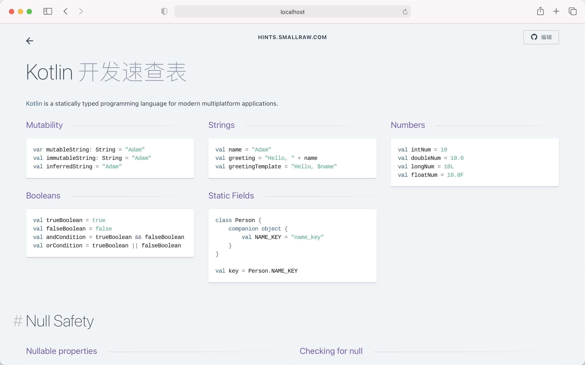

<h1 align='center'>Devhints</h1>

<blockquote align='center'>
开发速查表
</blockquote>

 

 
✨ <b><a href='http://hints.smallraw.com/'>hints.smallraw.com</a></b> ✨

 

---

See [CONTRIBUTING.md](CONTRIBUTING.md) for developer notes.

